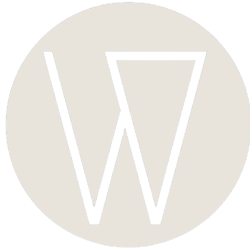

# Wren.
> Find your next homescreen beauty

A minimal, design-forward wallpaper discovery site built with vanilla HTML, CSS, and JavaScript. Fetches high-quality photos from the Unsplash API with infinite scroll, three themes, and desktop/mobile orientation switching.

## ✨ Features
- 🔍 Search wallpapers by keyword
- 🖼️ Masonry grid layout
- ♾️ Infinite scroll with Intersection Observer
- 🌙 Three themes — Dark, Light, Everforest
- 📱 Orientation toggle — Desktop & Mobile
- 👁️ Full preview modal
- ⬇️ One-click download
- 💾 Saves your theme + last search in localStorage

## 🛠️ Built With
- HTML5, CSS3, Vanilla JavaScript
- [Unsplash API](https://unsplash.com/developers)
- [Lucide Icons](https://lucide.dev)
- [DM Sans + DM Serif Display](https://fonts.google.com)
##  🌐 Site Preview

## 🚀 Live Demo
[wren.bilaldevdex.github.io]
(https://ibnhanif.github.io/wren/)
## 📸 Credits
All photos from [Unsplash](https://unsplash.com) — credited to their respective photographers.

---
Designed & built by [BilalDevDex](https://github.com/Bilaldevdex)
